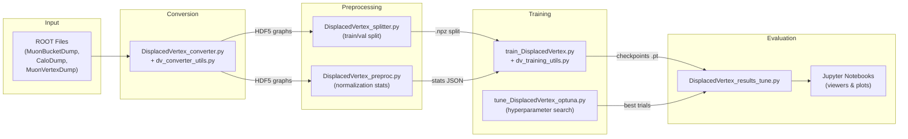
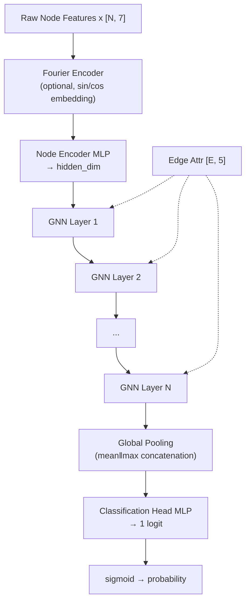

# MuonMLDisplacedVtx — Codebase Summary

## Project Overview

This is an **ATLAS experiment** (CERN) machine learning project for detecting **displaced vertices** in the muon spectrometer using **Graph Neural Networks (GNNs)**. The project builds heterogeneous graphs from muon segment and calorimeter tower data, then trains GNN models for **graph-level binary classification** (signal vs. background).

> [!NOTE]
> The project supports both a **vertex-position regression** pipeline (Cartesian/Polar/Cylindrical coordinates) referenced in the README, and a **binary classification** pipeline (the main focus of the current code). The classification pipeline determines whether an event contains a displaced vertex with transverse displacement ρ between 800 mm and 8000 mm.

---

## Architecture Diagram



---

## File-by-File Breakdown

### Core Utility Libraries

| File | Lines | Purpose |
|------|-------|---------|
| [dv_converter_utils.py](file:///e:/MuonMLDisplacedVtx/dv_converter_utils.py) | 1,784 | **The backbone library.** ROOT I/O, branch reading, coordinate conversions (Cartesian↔Polar↔Cylindrical), muon segment & calo tower node building, ΔR-based edge construction, edge feature computation, HDF5 writing, graph assembly, classification label logic, PyTorch dataset classes, and collate functions. |
| [dv_training_utils.py](file:///e:/MuonMLDisplacedVtx/dv_training_utils.py) | 2,313 | **Training infrastructure.** All GNN layer implementations (MPNN, EdgeConv, GAT, GraphSAGE — each with residual blocks), Fourier positional encoding, `DisplacedVertexGNN` model, loss functions (BCE, focal, asymmetric focal, label smoothing), DDP multi-GPU setup, EMA, cosine/plateau LR schedules, AUC/TPR-at-FPR metrics, checkpoint save/resume, W&B integration, and the full training loop. |

---

### Pipeline Scripts (executed in order)

#### Step 1: ROOT → HDF5 Conversion

| File | Lines | Purpose |
|------|-------|---------|
| [DisplacedVertex_converter.py](file:///e:/MuonMLDisplacedVtx/DisplacedVertex_converter.py) | 45 | Thin CLI wrapper that calls `run_dv_directory_conversion()` from `dv_converter_utils.py`. Converts each ROOT file into one HDF5 file with per-event graph data. Labels events as signal (y=1) if the ROOT filename matches signal patterns *and* at least one truth vertex has 800 < ρ < 8000 mm; otherwise background (y=0). |

**Graph structure per event:**
- **Node features `x`** `[N, 7]`: `[r_pos, theta_pos, phi_pos, theta_dir, phi_dir, energy_like, nCells_or_DoF]`
  - Muon nodes: `energy_like = 0`, `nCells_or_DoF = segment DoF`
  - Calo nodes: `energy_like = tower energy (MeV)`, `nCells_or_DoF = nCells`
- **Edge index** `[2, E]`: Directed segment↔tower edges for pairs within ΔR < 0.4
- **Edge features `edge_attr`** `[E, 5]`: `[Δenergy, Δphi, Δeta, cos_angle, same_sector]`
- **Label `y`** `[1]`: Binary 0/1

#### Step 2: Data Splitting

| File | Lines | Purpose |
|------|-------|---------|
| [DisplacedVertex_splitter.py](file:///e:/MuonMLDisplacedVtx/DisplacedVertex_splitter.py) | 197 | Creates a deterministic, **stratified** train/validation split. Outputs an `.npz` file with index arrays, label counts, and dataset metadata. Default: 10% validation. |

#### Step 3: Feature Normalization Stats

| File | Lines | Purpose |
|------|-------|---------|
| [DisplacedVertex_preproc.py](file:///e:/MuonMLDisplacedVtx/DisplacedVertex_preproc.py) | 459 | Scans all H5 files to compute per-feature normalization statistics (mean/std for standard, median/IQR for robust) separately for muon nodes, calo nodes, and edge attributes. Outputs a JSON file. Optionally writes normalized H5 copies. |

#### Step 4: Training

| File | Lines | Purpose |
|------|-------|---------|
| [train_DisplacedVertex.py](file:///e:/MuonMLDisplacedVtx/train_DisplacedVertex.py) | 74 | CLI entry point for DDP multi-GPU training. Calls `run_training()` from `dv_training_utils.py`. Defaults: `pos_weight=auto`, early-stop on `val_tpr_at_target_fpr`. |

#### Step 5: Hyperparameter Tuning

| File | Lines | Purpose |
|------|-------|---------|
| [tune_DisplacedVertex_optuna.py](file:///e:/MuonMLDisplacedVtx/tune_DisplacedVertex_optuna.py) | 843 | **Optuna-based hyperparameter search.** Manages a GPU allocator for parallel trials, parses training logs to extract metrics, supports fast-search + refit-top-k workflow. Searches over: layer type, hidden dim, # layers, dropout, LR, loss function, focal gamma, label smoothing, edge dropout, feature noise, weight decay, EMA decay, pos_weight, etc. |

#### Step 6: Evaluation & Analysis

| File | Lines | Purpose |
|------|-------|---------|
| [DisplacedVertex_results_tune.py](file:///e:/MuonMLDisplacedVtx/DisplacedVertex_results_tune.py) | 1,963 | Comprehensive evaluation: loads checkpoints, runs inference on train/val sets, computes ROC curves, TPR at multiple FPR working points, per-sample breakdown, optional ONNX export, generates structured results JSON and pickle payload for downstream plotting. |

---

### Jupyter Notebooks

| Notebook | Size | Purpose |
|----------|------|---------|
| [DisplacedVertex_results_plots.ipynb](file:///e:/MuonMLDisplacedVtx/DisplacedVertex_results_plots.ipynb) | 4.1 MB | Post-training result visualization (ROC curves, performance plots) |
| [DisplacedVertex_viewerCuts.ipynb](file:///e:/MuonMLDisplacedVtx/DisplacedVertex_viewerCuts.ipynb) | 408 KB | Cut-flow and selection studies |
| [DisplacedVertex_viewerEvents.ipynb](file:///e:/MuonMLDisplacedVtx/DisplacedVertex_viewerEvents.ipynb) | 3.3 MB | Event-level visualization |
| [DisplacedVertex_viewerEvents_haa.ipynb](file:///e:/MuonMLDisplacedVtx/DisplacedVertex_viewerEvents_haa.ipynb) | 2.2 MB | Event viewer for H→aa→4μ signal |
| [DisplacedVertex_viewerEvents_mu0.ipynb](file:///e:/MuonMLDisplacedVtx/DisplacedVertex_viewerEvents_mu0.ipynb) | 2.4 MB | Event viewer for μ=0 pileup samples |
| [DisplacedVertex_viewerGraphs.ipynb](file:///e:/MuonMLDisplacedVtx/DisplacedVertex_viewerGraphs.ipynb) | 2.5 MB | Graph structure visualization |

---

### Batch Job Infrastructure

| File | Purpose |
|------|---------|
| [scripts/prepare_inputs.sh](file:///e:/MuonMLDisplacedVtx/scripts/prepare_inputs.sh) | Wrapper that runs the splitter + preproc in sequence |
| [scripts/prepare_inputs.sub](file:///e:/MuonMLDisplacedVtx/scripts/prepare_inputs.sub) | HTCondor submit file for `prepare_inputs.sh` |
| [scripts/tune.sh](file:///e:/MuonMLDisplacedVtx/scripts/tune.sh) | Launches Optuna tuning with heartbeat logging |
| [scripts/tune.sub](file:///e:/MuonMLDisplacedVtx/scripts/tune.sub) | HTCondor submit file for GPU tuning jobs |
| [BucketDumperConfigs/](file:///e:/MuonMLDisplacedVtx/BucketDumperConfigs) | 11 shell scripts configuring ATLAS simulation + data dumping for various signal samples (HNL, H→aa→μμ with different masses/lifetimes) |

---

## GNN Model Architecture



**Supported GNN layer types:**
- **MPNN** (`EdgeMPNNLayer`): Message-passing with edge features, LayerNorm, residual connections
- **EdgeConv Residual** (`EdgeResidualBlock`): Two-layer EdgeConv with skip connections
- **GAT Residual** (`GATResidualBlock`): Multi-head attention with residual connections
- **GraphSAGE Residual** (`SAGEResidualBlock`): Neighborhood aggregation with L2 normalization

**Key training features:**
- Multi-GPU via PyTorch `DistributedDataParallel`
- Mixed precision (AMP with bf16/fp16)
- Model-side feature normalization (stats stored as buffers)
- EMA (exponential moving average)
- Multiple loss functions: BCE, BCE with label smoothing, Focal, Asymmetric Focal
- Early stopping on TPR@1%FPR
- Cosine or ReduceOnPlateau LR schedules

---

## Physics Context

| Concept | Details |
|---------|---------|
| **Displaced vertex** | A secondary particle decay vertex far from the interaction point, signature of long-lived BSM particles |
| **Signal region** | Transverse displacement ρ ∈ (800, 8000) mm in the ATLAS muon spectrometer |
| **Signal samples** | Dark photons (a→μμ), H→aa→4μ with various masses (2–100 GeV) and lifetimes (cτ 100–5000 mm) |
| **Background samples** | Z→μμ, J/ψ, dijet (jj), tt̄ — all at μ=200 pileup |
| **Nodes** | Muon segments (position, direction, DoF) + calorimeter towers (position, energy, nCells) |
| **Edges** | Segment↔tower pairs within ΔR < 0.4 |

---

## Dependencies

```
numpy, h5py, uproot, torch, optuna, wandb, pandas, scikit-learn, matplotlib, onnx, onnxruntime
```
